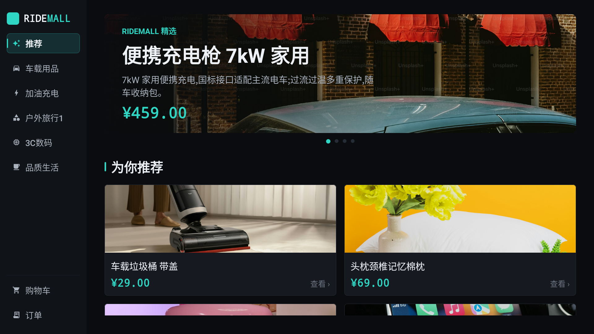
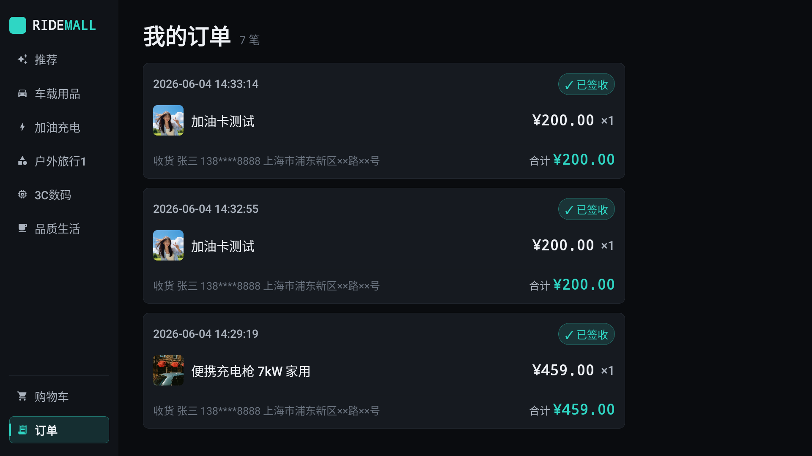
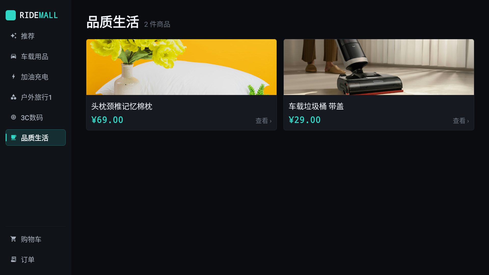
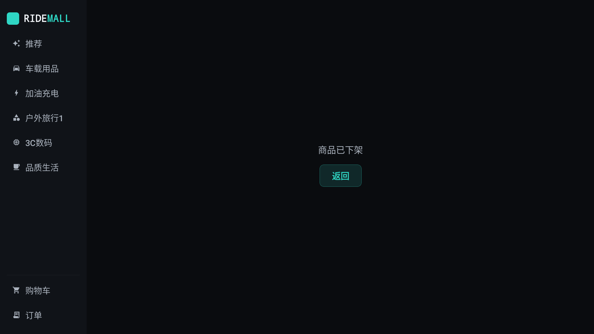

<div align="center">

# 🚗 RIDEMALL · 车载商店

**车机横屏电商 demo** — 车机端 Android 商城 + 网页后台 + Flask/SQLite 后端，端到端打通「浏览 → 购物车 → 下单 → 物流 → 退换」全闭环。


> 内部演示性质：支付 / 退款 / 物流均为 mock，不接真实交易。

</div>

---

## 截图

| 推荐首页（车机横屏） | 订单历史（状态机 + mock 物流） |
|---|---|
|  |  |

| 商品下架 → 顾客侧消失 | 不可用商品 → 友好提示可返回（非死页） |
|---|---|
|  |  |

---

## 特性

**车机端（in-car Android）**
- 沉浸式 1920×1080 横屏浏览：推荐轮播 / 分类网格 / 商品详情，品牌深色主题
- 购物车 + 多商品下单闭环 + 扫码支付倒计时动效
- 订单全生命周期：状态机惰性自动推进（mock）→ mock 物流轨迹 → 签收前取消 → 7 天无理由退货
- 商品下架对顾客**彻底隐藏**；购买已下架/已删商品 → 明确提示并移出购物车（不再误报网络异常）

**网页后台（admin）**
- 分类管理（增 / 删 / 改名 / 排序 / 停用）
- 商品管理（增 / 改 / 传图换图 / **下架·上架** / 受限删除）
- 推荐位管理（先选分类 → 再选商品，限 3–5 个，可排序）
- 订单状态管理 + **一键快进**（演示用）+ 退货审核；仪表盘

**后端**
- 车机只读接口 + 下单接口（JSON）；下单整单**价格快照**（事后改价 / 删商品不影响历史订单）
- 下单逐件校验商品「存在且在架」，不可用整单拒绝（`409 商品已下架`）
- 纯业务规则（`rules/`）**100% 单测覆盖**（机器闸门）

---

## 架构

务实分层，依赖单向（详见 [docs/architecture.md](docs/architecture.md) / [ADR-0001](docs/adr/0001-backend-architecture.md)）：

```
后端    接口层(api/) → 业务层(services/) → 数据层(repositories/) → 数据表(models/)
                          ＋ 业务规则(rules/，纯函数，无 IO，100% 单测)
车机端  ui(Compose) → viewmodel → repository → api(Retrofit)   本地仅存设备号
```

| 层 | 技术 |
|---|---|
| 后端 | Python 3.11 · Flask · SQLite |
| 后台 UI | Bootstrap 5 · Jinja2（服务端渲染） |
| 车机端 | Kotlin · Jetpack Compose（MVVM）· Retrofit + Moshi + Coil · minSdk 26 |
| 测试 | pytest（`rules` 100% 覆盖闸门）· JUnit（车机纯逻辑） |
| 变更管理 | [OpenSpec](https://github.com/Fission-AI/OpenSpec)（propose → apply → archive） |
| 部署 | rsync + launchd + Cloudflare Tunnel |

---

## 快速开始

### 后端 / 测试
```bash
python3 -m venv .venv && .venv/bin/pip install -r requirements.txt
.venv/bin/python run.py            # 起后端(端口/路径走 env,见 server/config.py)
.venv/bin/python -m pytest         # 全部测试 + rules 100% 覆盖率闸门
.venv/bin/pre-commit install       # 装提交硬卡(测试不绿则 commit 被拦)
```
环境变量：`RIDEMALL_PORT`（默认 8000）/ `RIDEMALL_DB` / `RIDEMALL_UPLOADS` / `RIDEMALL_ADMIN_PASSWORD`（均不入库）。

### 车机端（Android）
工程在 [`android/`](android/)，需 JDK 17 + Android SDK（android-34）。
```bash
.venv/bin/python run.py            # 先起后端(模拟器经 10.0.2.2 访问宿主回环)
cd android
JAVA_HOME=$(/usr/libexec/java_home -v 17) ./gradlew :app:assembleDebug
JAVA_HOME=$(/usr/libexec/java_home -v 17) ./gradlew :app:testDebugUnitTest   # 车机纯逻辑单测
```
base URL 走 `BuildConfig.API_BASE_URL`：debug = `http://10.0.2.2:8000`，release = 公网域名（不硬编码）。车机本地只存一个设备号（SharedPreferences），不缓存任何业务数据。

---

## 质量门禁

- **提交闸门**：`pre-commit` 跑 `pytest` + `rules` 100% 覆盖率（`--cov-fail-under=100`），不绿则 commit 被拦。
- **变更门禁**：每个 OpenSpec change 须 `openspec validate --strict` 通过；归档前强制 pytest 全绿。
- **真相优先级**：范围 → `需求共识.md`；正式需求/场景 → `openspec/specs/`；行为 → 测试；跨切片决策 → `docs/adr/`。

---

## 部署

后端经 `rsync` 同步到一台常驻 Mac mini，用 `launchd` 守护、Cloudflare Tunnel 暴露公网（`/admin` 后台 + `/api` 车机接口）。商品上架状态等结构变更随启动**幂等迁移**自动生效（加列默认在架，不动既有数据）。

> 🔴 **安全说明**：演示用单管理员、弱口令（口令只存部署环境变量，不入库）。公网演示属已知风险，**演示结束须将后台服务下线**。

---

## 文档地图

| 我要看 | 去哪 |
|---|---|
| 做什么 / 不做什么 | [需求共识.md](需求共识.md) |
| 接口 / 后端数据 | [docs/api.md](docs/api.md) · [后端需求.md](后端需求.md) |
| 系统架构 / 为什么这样设计 | [docs/architecture.md](docs/architecture.md) · [docs/adr/](docs/adr/) |
| 正式需求 + 场景（真相源） | [`openspec/specs/`](openspec/specs/) |
| 变更提案 / 实现任务 | [`openspec/changes/`](openspec/changes/) |
| 测试方案 / 技术债 | [测试方案.md](测试方案.md) · [docs/tech-debt.md](docs/tech-debt.md) |
| 视觉 / 交互还原 | [design_handoff_ridemall_carstore/](design_handoff_ridemall_carstore/) |
| 协作纪律 | [CLAUDE.md](CLAUDE.md) |
